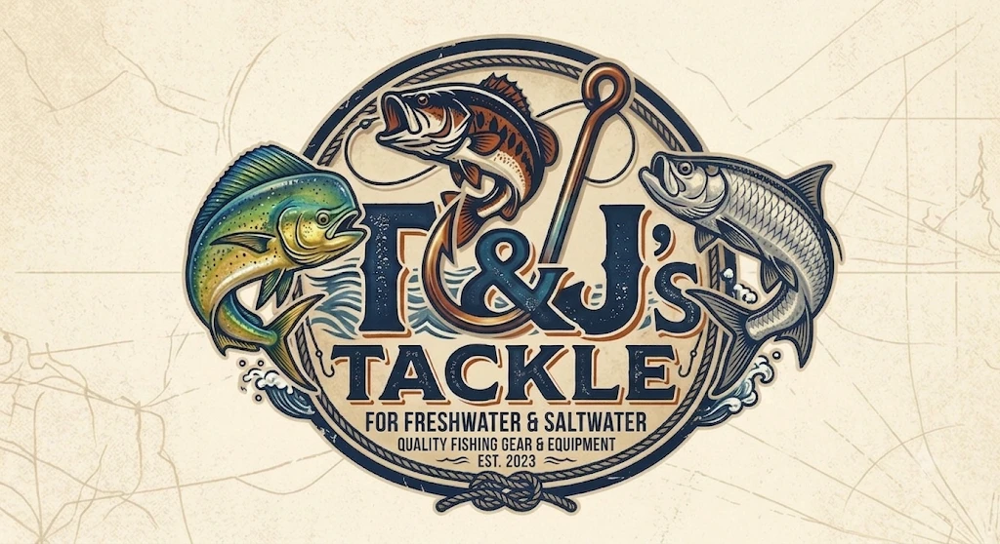

# T&J's Tackle

**For Freshwater & Saltwater · Quality Fishing Gear & Equipment · Est. 2023**



T&J's Tackle is a soft-plastic fishing lure company built like a **manufacturing
company first** — e-commerce, product engineering, mold management, plastisol
formulation, and inventory integrated from day one.

This repository is the beginning of the **T&J's Tackle operating system**. It is
intentionally scoped to a solid, production-ready **Phase 1 foundation** rather
than a half-finished sprawl of empty apps. Everything beyond Phase 1 is captured
and prioritized in [`ROADMAP.md`](ROADMAP.md).

---

## What's in this repository today (Phase 1)

| Area | Location | Status |
| --- | --- | --- |
| Premium brand website (Next.js 14, App Router, Tailwind) | [`apps/website`](apps/website) | ✅ Working |
| "Find My Lure" selector tool | [`apps/website/src/app/find-my-lure`](apps/website/src/app/find-my-lure) | ✅ Working |
| Soft-plastic product catalog + data model | [`apps/website/src/data`](apps/website/src/data) | ✅ Working |
| Manufacturing domain database schema (Prisma) | [`packages/database`](packages/database) | ✅ Schema + seed |
| Pricing & unit-economics engine (cost/bait, margins, wholesale) | [`packages/pricing`](packages/pricing) | ✅ Tested |
| Company financial model / path to profitability | [`docs/UNIT-ECONOMICS.md`](docs/UNIT-ECONOMICS.md) | ✅ Written |
| Architecture & design system docs | [`docs`](docs) | ✅ Written |
| Full company build roadmap ("build later" backlog) | [`ROADMAP.md`](ROADMAP.md) | ✅ Written |
| Deployment config (Render Blueprint + Supabase wiring) | [`render.yaml`](render.yaml) · [`docs/DEPLOYMENT.md`](docs/DEPLOYMENT.md) | ✅ Ready to deploy |
| GitHub standards (CI, templates, CODEOWNERS) | [`.github`](.github) | ✅ Configured |

## Company focus (Phase 1)

The company initially manufactures **only**:

- Soft Plastic Fishing Lures
- Aluminum Injection Molds
- Custom Color Plastics
- Prototype Lures
- Limited Edition Drops

Future expansion (hard baits, rods, reels, terminal tackle, apparel, electronics)
is designed for but deliberately **not built yet** — see the roadmap.

## Monorepo layout

```
apps/
  website          # Customer-facing brand + storefront (Next.js)
packages/
  database         # Prisma schema: lures, molds, plastisol, colors, inventory, QC
  pricing          # Unit-economics engine: cost/bait, margins, wholesale, break-even
docs/
  ARCHITECTURE.md  # System design & the full app/service map (future-ready)
  DESIGN-SYSTEM.md # Brand palette, typography, voice
ROADMAP.md         # Everything from the master brief, prioritized and flagged
```

The workspace is set up for growth: new apps (`admin`, `warehouse`,
`mold-manager`, …) and packages (`ui`, `auth`, `pricing`, …) drop into
`apps/*` and `packages/*` without restructuring.

## Getting started

```bash
# From the repo root
npm install

# Run the website in dev mode → http://localhost:3000
npm run dev

# Type-check and build the site
npm run typecheck
npm run build

# Validate the manufacturing database schema
npm run db:validate

# Run the pricing / unit-economics tests
npm run pricing:test
```

> The website runs with sample seed data and needs no database or secrets to
> boot. The Prisma schema in `packages/database` documents the full production
> data model and is validated in CI; wiring a live Postgres instance is a
> Phase 2 task (see the roadmap).

## Design principles

Every feature in this repo answers at least one of these:

1. Does it help us design better lures?
2. Does it improve manufacturing quality?
3. Does it reduce production cost?
4. Does it increase customer trust?
5. Does it increase repeat purchases?
6. Does it create a competitive advantage that is hard to replicate?

## License & IP

All designs, brand assets, and product concepts are original to T&J's Tackle.
This code is proprietary and unlicensed for redistribution.

See [`CONTRIBUTING.md`](CONTRIBUTING.md) for development standards.
